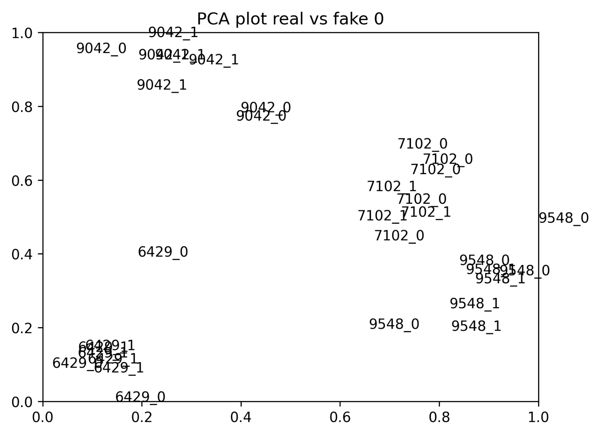
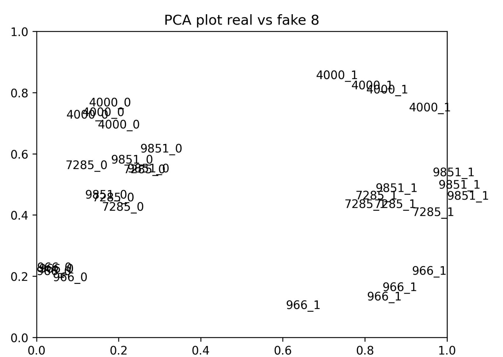
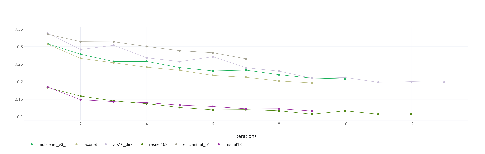
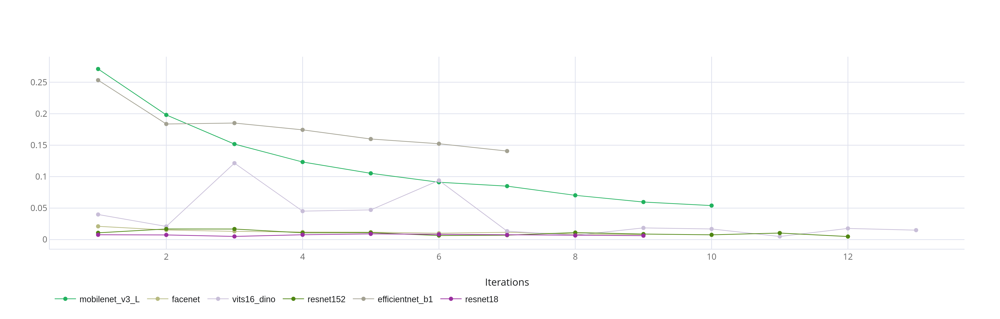

# Kryptonite-ML-Challenge


## Loss selection
We start by verifying the facenet model, which is pretrained on face recognition, and observe its performance on our dataset.

In the baseline experiment, triplets are formed regardless of whether or not they are fake.
To understand the performace, the distances between anchors and their positive, negative, and fake pairs were measured.


The goal is to reduce the distance between anchors and their positive pairs, and increase the distance between anchors and their negative pairs, while pushing away fake images. For that the following loss was proposed:

**loss** = triplet(anchor, positive, negative) + triplet(anchor, positive, fake)

To measure the response of the model on intra-class (including fake images) and inter-class identities, two eer-based metrics were proposed.

- eer_real: eer for positive pairs and negative-real pairs.

- eer_fake: eer for positive pairs and negative-fake pairs.

This loss function showed significant increase in the results with only 2 epochs of training.

| Method                     | eer_real | eer_fake |
|----------------------------|----------|----------|
| triplet loss               | 0.1041   | 0.425    |
| triplet loss real + fake   | 0.1374   | 0.025    |


With the proposed loss, we can see the increased distance of fake images.


This can be seen in the embedding space, where after training the model learns to distinguish between real and fake images.
<div style="display: flex; justify-content: center;">




</div>

However, while pushing away fake images, the distance to negative images decreases, which makes it necessary to investigate some methods to deal with the trade-off between errors on real and fake images.

## Model selection
**eer real**:

**eer fake**:


## Investigating loss function
As an attempt to deal with the trade-off between errors on real and fake images, a regularization coefficient was added
to the fake loss term to reduce its effect, and therefore decrease the error on different identities, and making a small increase
in the error on fake images. In addition, a cosine similarity head was added to the model as an attempt to help the model to distinguish
between pairs of real people (positive and negative pairs). However, this did not improve the results, and therefore lambda was set to 1, without using cosine head. The results are shown below:

| Lambda         | eer_real | eer_fake |
|----------------|----------|----------|
| 0.01           | 0.149    | 0.067    |
| 0.1            | 0.145    | 0.016    |
| 1              | 0.148    | 0.007    |
| 1 + cos head   | 0.157    | 0.005    |


## Data augmentation
The cutout data augmentation technique was used as a potential method to guide the model to focus on specific
parts of the face more than others.
(6 epochs)
| Cutout Part | eer_real | eer_fake |
|-------------|--------  | -------- |
| mouth       | 0.178    | 0.0169   |
| nose        | 0.1759   | 0.0156   |
| eyes        | 0.242    | 0.132    |
| no cutout   | 0.129    | 0.008    |

We conclude that cutout is not an effective method for this task.

## Final model
**Resnet18** was selected with the proposed loss function and trained on 25 epochs until convergence.

Score on public test set: **0.0632**

Weights: [download](https://drive.google.com/file/d/1X2d7EwDhfdLDHZ2Lug70eOGZJg75M8Uj/view?usp=sharing)

## Install

1. Create conda environment and install dependencies

```bash
git clone git@github.com:BasselSh/Kryptonite-ML-Challenge.git

cd Kryptonite-ML-Challenge

conda create -n krypto python=3.10.12 -y

conda activate krypto

git clone https://github.com/OML-Team/open-metric-learning.git

cd open-metric-learning

pip install -r ci/requirements.txt

pip install -e .

cd ..
```

2. Download dataset and place it in the data/ directory

Train: [download](https://storage.codenrock.com/companies/codenrock-13/contests/kryptonite-ml-challenge/train.zip) 

Test: [download](https://storage.codenrock.com/companies/codenrock-13/contests/kryptonite-ml-challenge/test_public.zip)

Numbers of files is written with zero padding, which is not suitable. Remove it by running:

```bash
python preprocess_meta.py
```

3. download facenet pytorch

```bash
git clone https://github.com/timesler/facenet-pytorch.git facenet_pytorch
```

4. Install clearml for logging, and add your api key to the clearml.yaml file in the root directory.

```bash
pip install clearml==1.17.1
```

5. Train


```bash
python train.py resnet18
```
The output directory, in which the best model with be saved, will be stored in the last_work_dir.txt file, which will be used for submission.

### Script Arguments

The following arguments can be used with the `train.py` script:

| Argument          | Description                                      |
|-------------------|--------------------------------------------------|
| `<model-name>`    | Name of the model to train. Predefined models: `resnet18`, `resnet50`, `resnet152`, `efficientnet_b0`, `facenet`, `efficientnet_b0`, `vits16_dino`, `mobilenet_v3_large`. For generic models add the definition in the parameters.py file.                     |
| `<description>`   | The output directory is automatically named based on models parameters. Description is an additional text that will be added to the directory name.                  |
| `<epochs>`        | Number of epochs to train the model.             |
| `<loss>`          | Loss function to use during training. Predefined losses are **triplet** and **quadruplet**. For generic losses add the definition in the parameters.py file.            |
| `<margin>`        | Margin value for the triplet and quadruplet losses.               |
| `<lr>`            | Learning rate for the optimizer.                 |
| `<cutout>`        | A probability of applying cutout augmentation. Default is 0. |
| `<gray>`          | A probability of converting images to grayscale. Default is 0. |
| `<no_fake_loss>`  | Whether to disable fake loss calculation. Default is False. |
| `<cutout_option>` | Options for cutout augmentation. It will be applied only if cutout is not 0. The available options are **all**, **mouth**, **nose**, **eyes**.                  |
| `<with_cos_head>` | Whether to use cosine head. Default is False.        |
| `<lambda_fake>`   | Weight for the fake loss in the overall loss. Default is 0.   |

For training the model for the competition:

6. Make submission

```bash
python make_submission.py resnet18
```
the submission will be saved in the same directory as the model.