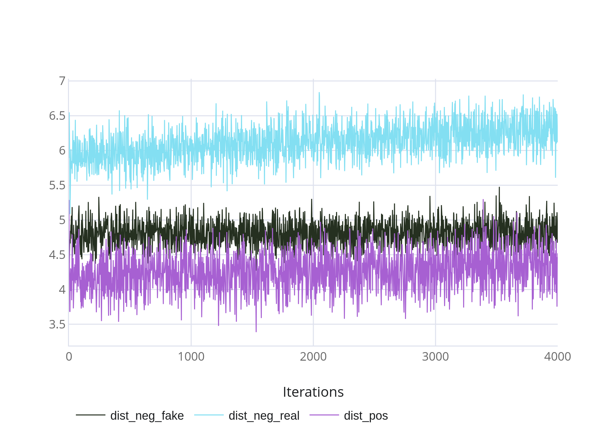

# Kryptonite-ML-Challenge


# Loss selection
We start by verifying the facenet model, which is pretrained on face recognition, and observe its performance on our dataset.

In the base experiment, triplets are formed regardless of whether or not they are fake.
To understand the performace, the distances between anchors and their positive, negative, and fake pairs were measured.
<div align="center">

</div>
<!--  -->

The goal is to reduce the distance between anchors and their positive pairs, and increase the distance between anchors and their negative pairs, while pushing away fake images. For that the following loss was proposed:
loss = triplet(anchor, positive, negative) + triplet(anchor, positive, fake)
This loss function showed significant increase in the results with only 2 epochs of training.

| Method                     | eer_real | eer_fake |
|----------------------------|----------|----------|
| triplet loss               | 0.1041   | 0.425    |
| triplet loss real + fake   | 0.1374   | 0.025    |


With the proposed loss, we can see the increased distance of fake images.
<div align="center">

</div>

This can be seen in the embedding space, where after training the model learns to distinguish between real and fake images.
<div style="display: flex; justify-content: center;">


</div>

However, while pushing away fake images, the distance to negative images decreases, which is not desirable.
To measure the effect of the distances, two eer-based metrics were proposed.
One of them calculates eer for positive pairs and negative-fake pairs, while the other one calculates eer for positive pairs and negative-real pairs.

# Model selection


# Investigating loss function

| Lambda         | eer_real | eer_fake |
|----------------|----------|----------|
| 0.01           | 0.149    | 0.067    |
| 0.1            | 0.145    | 0.016    |
| 1              | 0.148    | 0.007    |
| 1 + cos head   | 0.157    | 0.005    |


# Data augmentation
The cutout data augmentation technique was used as a potential method to guide the model to focus on specific
parts of the face more than others.
(6 epochs)
| Cutout Part | eer_real | eer_fake |
|-------------|--------  | -------- |
| mouth       | 0.178    | 0.0169   |
| nose        | 0.1759   | 0.0156   |
| eyes        | 0.242    | 0.132    |
| no cutout   | 0.129    | 0.008    |

We conclude that cutout is not an effective method for this task.


# Install

1. Create conda environment and install dependencies

```bash
git clone git@github.com:BasselSh/Kryptonite-ML-Challenge.git

cd Kryptonite-ML-Challenge

conda create -n krypto python=3.10.12 -y

conda activate krypto

git clone https://github.com/OML-Team/open-metric-learning.git

cd open-metric-learning

pip install -r ci/requirements.txt

pip install -e .

cd ..
```

3. In open-metric-learning/oml/inference/abstract.py comment the following for enabeling inference with **cuda**: 

(lines 30-31)

```python
    # if is_ddp():
    #     loader = patch_dataloader_to_ddp(loader)
```
(lines 50-52)

```python
    # data_to_sync = {"outputs": outputs, "ids": ids}
    # data_synced = sync_dicts_ddp(data_to_sync, world_size=get_world_size_safe())
    # outputs, ids = data_synced["outputs"], data_synced["ids"]
```

5. Download dataset and place it in the data/ directory

Train: https://storage.codenrock.com/companies/codenrock-13/contests/kryptonite-ml-challenge/train.zip

Test: https://storage.codenrock.com/companies/codenrock-13/contests/kryptonite-ml-challenge/test_public.zip

6. download facenet pytorch

```bash
git clone https://github.com/timesler/facenet-pytorch.git facenet_pytorch
```


python preprocess_meta.py

pip install clearml==1.17.1


7. Train

```bash
python train_val_pca.py "quadruplet_loss" --with_pca 
```


## Additional experiments

Add the following lines to facenet_pytorch/models/mtcnn.py:

```python
batch_boxes, batch_probs, batch_points = self.detect(img, landmarks=True)
non_none_boxes_ids = [i for i, box in enumerate(batch_boxes) if box is not None]
if len(non_none_boxes_ids) == 0:
    return None, None
```
